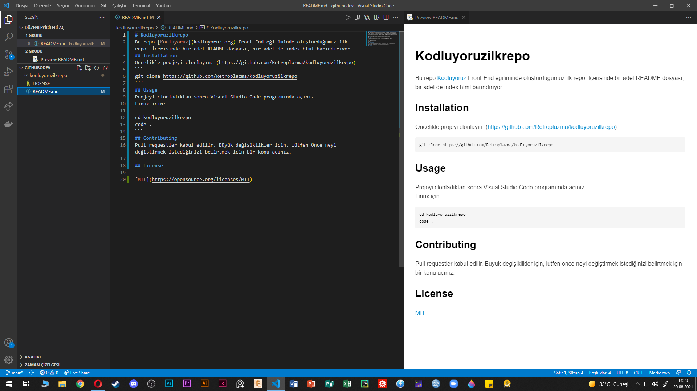

# Kodluyoruzilkrepo
Bu repo [Kodluyoruz](kodluyoruz.org) Front-End eğitiminde oluşturduğumuz ilk repo. İçerisinde bir adet README dosyası, bir adet de index.html barındırıyor.
## Installation
Öncelikle projeyi clonlayın. (https://github.com/Retroplazma/kodluyoruzilkrepo)
```
git clone https://github.com/Retroplazma/kodluyoruzilkrepo
```
## Usage
Projeyi clonladıktan sonra Visual Studio Code programında açınız.
Linux için:
```
cd kodluyoruzilkrepo
code .
```
## Contributing
Pull requestler kabul edilir. Büyük değişiklikler için, lütfen önce neyi değiştirmek istediğinizi belirtmek için bir konu açınız.

## License

[MIT](https://opensource.org/licenses/MIT)

### Projemizin bir resmi
